# معماری Second Brain OS

نسخهٔ سند: ۱٫۰ — به‌روز تا commit فعلی شاخهٔ `main` (2026-10-07)
دامنهٔ استقرار: `https://brain.adakpro.com` (پشت ArvanCloud CDN)

این سند معماری کامل محصول را توضیح می‌دهد: اجزا، مرزهای اعتماد، جریان داده، مدل داده، پروتکل‌های حساس (apply، rollback، backup)، دو مسیر اتصال Claude، امنیت، استقرار و آزمون. نمودارها با Mermaid نوشته شده‌اند و GitHub آن‌ها را مستقیم رسم می‌کند.

---

## فهرست

1. [هدف و اصول طراحی](#۱-هدف-و-اصول-طراحی)
2. [نمای کلان سیستم](#۲-نمای-کلان-سیستم)
3. [سرویس‌ها، شبکه‌ها و volumeها](#۳-سرویسها-شبکهها-و-volumeها)
4. [ساختار کد (monorepo)](#۴-ساختار-کد-monorepo)
5. [احراز هویت و نشست](#۵-احراز-هویت-و-نشست)
6. [مدل داده](#۶-مدل-داده)
7. [Vault و فایل‌های Markdown](#۷-vault-و-فایلهای-markdown)
8. [ورود منبع و استخراج](#۸-ورود-منبع-و-استخراج)
9. [موتور عامل و اجرای مدل](#۹-موتور-عامل-و-اجرای-مدل)
10. [ChangeSet: پیشنهاد، اعمال، بازگردانی](#۱۰-changeset-پیشنهاد-اعمال-بازگردانی)
11. [پرسش مستند، ارجاع و SSE](#۱۱-پرسش-مستند-ارجاع-و-sse)
12. [جست‌وجوی فارسی](#۱۲-جستوجوی-فارسی)
13. [دو مسیر اتصال Claude](#۱۳-دو-مسیر-اتصال-claude)
14. [امنیت و مرزهای اعتماد](#۱۴-امنیت-و-مرزهای-اعتماد)
15. [پشتیبان، بازیابی و انتقال داده](#۱۵-پشتیبان-بازیابی-و-انتقال-داده)
16. [صف، زمان‌بندی و مشاهده‌پذیری](#۱۶-صف-زمانبندی-و-مشاهدهپذیری)
17. [فرانت‌اند](#۱۷-فرانتاند)
18. [استقرار، دامنه و عملیات](#۱۸-استقرار-دامنه-و-عملیات)
19. [فناوری‌ها و نسخه‌ها](#۱۹-فناوریها-و-نسخهها)
20. [راهبرد آزمون](#۲۰-راهبرد-آزمون)
21. [محدودیت‌ها و مسیر آینده](#۲۱-محدودیتها-و-مسیر-آینده)

---

## ۱. هدف و اصول طراحی

Second Brain OS یک سامانهٔ شخصیِ خودمیزبان مدیریت دانش است: مالک منبع وارد می‌کند (متن، Markdown، URL، PDF، خروجی گفتگو)، Claude آن را به صفحات ویکیِ به‌هم‌پیوسته تبدیل می‌کند، مالک تغییرات را بررسی و تأیید می‌کند و بعد از دانش خودش با ارجاع پاسخ می‌گیرد. منطق محتوایی از مخزن [`undefined-ui/second-brain-os`](https://github.com/undefined-ui/second-brain-os) (commit `d6861cc`، MIT) و ظاهر از HTML مرجع بستهٔ پیاده‌سازی گرفته شده است.

| اصل | پیامد معماری |
|---|---|
| **هیچ تغییر هوشمندی بی‌اجازه وارد دانش نمی‌شود** | عامل فقط `ChangeSet` می‌سازد؛ تنها `api` در vault می‌نویسد و فقط پس از تأیید. |
| **Markdown قابل حمل است** | vault همان ساختار upstream را دارد؛ PostgreSQL دادهٔ عملیاتی و نسخه‌ها را نگه می‌دارد. |
| **بدون کلید مدل هم کار کند** | ورود، کتابخانه، ویرایش، جست‌وجو، پروژه و خروجی مستقل از مدل‌اند؛ readiness به مدل وابسته نیست. |
| **کمترین دسترسی** | runner بدون DB، بدون vault، بدون اینترنت و بدون کلید دائمی؛ native بدون هیچ secret محصول. |
| **دو مسیر Claude جدا** | کارت API برای اتوماسیون؛ Claude Code رسمی با اشتراک فقط برای استفادهٔ خود مالک. |
| **ادعای صادقانه** | mock همیشه برچسب دارد؛ قابلیت پیاده‌نشده دکمهٔ موفق نمایشی ندارد. |

---

## ۲. نمای کلان سیستم

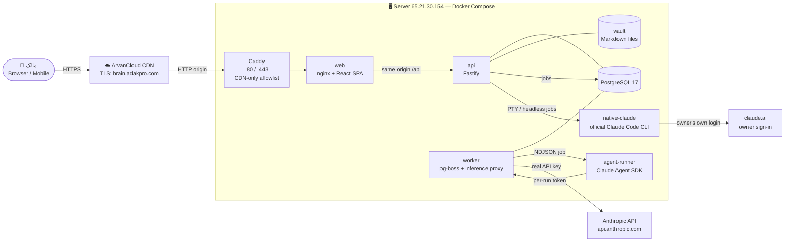

**نکتهٔ کلیدی:** مرورگر فقط با یک origin کار می‌کند (`https://brain.adakpro.com`). همهٔ فراخوانی‌ها، SSE و WebSocket ترمینال از همین origin عبور می‌کنند.

---

## ۳. سرویس‌ها، شبکه‌ها و volumeها

### ۳٫۱ سرویس‌ها

| سرویس | image | نقش | پورت داخلی | پورت میزبان |
|---|---|---|---|---|
| `caddy` | `caddy:2.10.2-alpine` | ورودی عمومی پشت CDN؛ فقط IPهای ArvanCloud | 80, 443 | `0.0.0.0:80/443` (فقط در overlay تولید) |
| `web` | `secondbrain/web` (nginx-unprivileged 1.29.3) | فایل‌های SPA، reverse proxy، CSP | 8080 | فقط در حالت local: `127.0.0.1:8080` |
| `api` | `secondbrain/api` | منطق محصول، auth، تنها نویسندهٔ vault، SSE، WS ترمینال | 3000 | — |
| `worker` | `secondbrain/worker` | صف pg-boss، استخراج، اجرای run، inference proxy | 8790 | — |
| `agent-runner` | `secondbrain/agent-runner` | اجرای Agent SDK با ابزارهای محدود | 8791 | — |
| `postgres` | `postgres:17.6-bookworm` | دادهٔ عملیاتی و صف | 5432 | — |
| `migrate` | همان image `api` | one-shot: migration + schema صف | — | — |
| `native-claude` | `secondbrain/native-claude` (profile `native`) | باینری رسمی Claude Code 2.1.291 | 8792 | — |

### ۳٫۲ شبکه‌ها و دسترسی

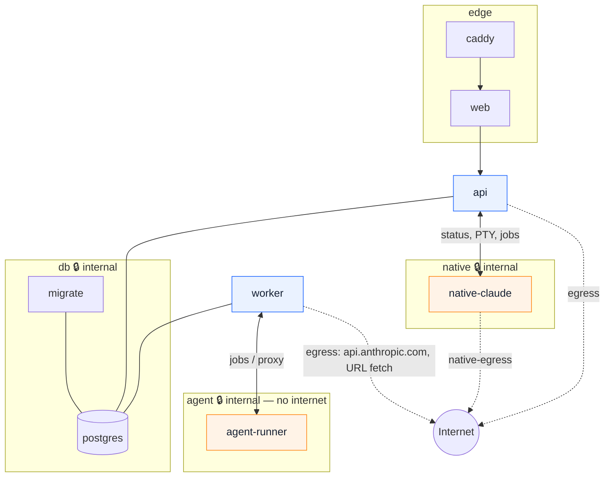

| شبکه | `internal` | اعضا | هدف |
|---|---|---|---|
| `edge` | خیر | caddy، web، api | مسیر درخواست کاربر |
| `db` | **بله** | postgres، migrate، api، worker | DB بدون خروجی اینترنت |
| `agent` | **بله** | worker، agent-runner | runner فقط به proxy worker می‌رسد |
| `native` | **بله** | api، native-claude | ترمینال و jobهای اشتراک |
| `egress` | خیر | api، worker | Anthropic API، دریافت URL، آزمون کلید |
| `native-egress` | خیر | native-claude | ورود و درخواست‌های خود Claude Code |

### ۳٫۳ secretها و volumeها

| secret (Docker file secret) | دریافت‌کنندگان | **ندارند** |
|---|---|---|
| `db_password` | postgres، migrate، api، worker | runner، web، native |
| `master_key` | migrate، api، worker | runner، web، postgres، native |
| `internal_token` | migrate، api، worker، agent-runner | web، postgres، native |

| volume | mount | محتوا | در backup عادی |
|---|---|---|---|
| `pg-data` | postgres | پایگاه داده | ✔ (snapshot منطقی) |
| `vault-data` | api | `vault/<workspace>/…` | ✔ |
| `source-data` | api، worker | فایل‌های خام منابع (content-addressed) | ✔ |
| `backup-data` | api | آرشیوهای پشتیبان | — |
| `native-home` | native-claude | HOME و credential خود CLI | ✘ (عمداً) |
| `native-staging` | native-claude | کپی کاری vault برای Claude Code | ✘ |
| `caddy-data/config` | caddy | گواهی internal | ✘ |

همهٔ سرویس‌های اپ: کاربر غیرroot، `read_only` rootfs، `cap_drop: ALL`، `no-new-privileges`، tmpfs محدود، سقف حافظه/CPU و rotation لاگ.

---

## ۴. ساختار کد (monorepo)

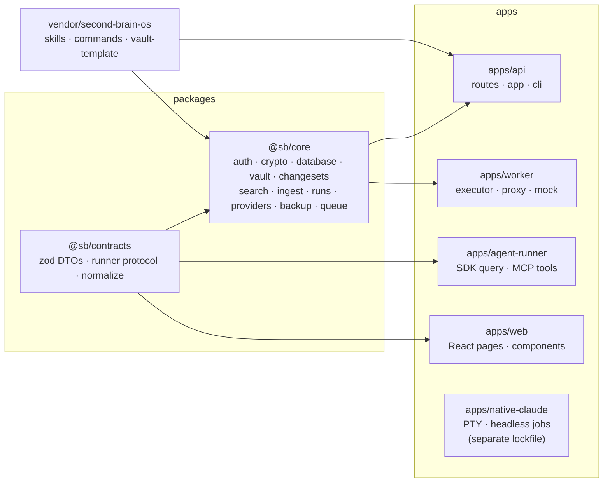

```text
apps/
  api/            Fastify: routes/{auth,workspaces,sources,documents,changesets,runs,ask,projects,
                  studio,knowledge,admin,native,backups,transfer,system}.ts, app.ts, cli.ts
  worker/         main.ts (queues, schedules), executor.ts, proxy.ts, mock-anthropic.ts
  agent-runner/   main.ts (SDK query), tools.ts (MCP tools)
  web/            pages/*, components/{shell,ui,content,add-source,command-palette,claude-task}
  native-claude/  src/main.mjs (PTY + headless jobs), own package-lock.json
packages/
  contracts/      api.ts, runner.ts, normalize.ts
  core/           auth, crypto, database (migrations), vault, markdown, changesets, search,
                  ingest, net (safe-fetch), providers, agents (registry, prompts), runs,
                  health, schedules, queue, archive (zip), backup
vendor/second-brain-os/   نسخهٔ pin‌شدهٔ upstream (MIT) + SHA256SUMS
infra/docker/     node.Dockerfile, native.Dockerfile, nginx.conf, Caddyfile*, 
scripts/          bootstrap, create-admin, doctor, backup, restore, update, test, lint
compose.yaml · compose.production.yaml · compose.test.yaml
```

هر app با esbuild به یک فایل bundle می‌شود؛ ماژول‌های native (`@node-rs/argon2`، `pg`، `pg-boss`، `pdfjs-dist`، `linkedom`، Agent SDK) external هستند و با `pnpm deploy --prod` از lockfile نصب می‌شوند.

---

## ۵. احراز هویت و نشست

ورود به برنامه کاملاً مستقل از حساب Claude است. مالک اول فقط با CLI ساخته می‌شود (`scripts/create-admin.sh`)؛ حساب پیش‌فرض و ثبت‌نام عمومی وجود ندارد.

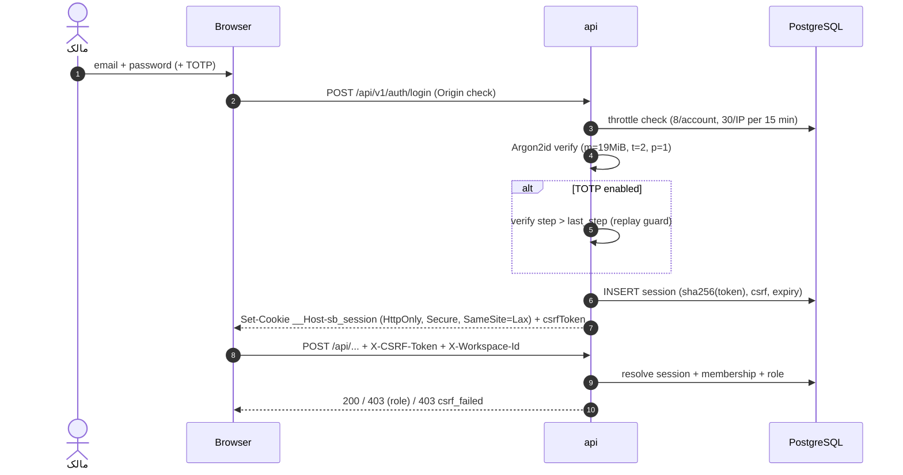

| کنترل | جزئیات |
|---|---|
| نشست | توکن ۳۲ بایتی، فقط hash در DB؛ انقضای مطلق ۷ روز، idle ۱۲ ساعت؛ چرخش هنگام ورود؛ logout و logout-all واقعی |
| CSRF | توکن مرتبط با نشست در header برای همهٔ درخواست‌های تغییردهنده + بررسی `Origin`؛ CORS خاموش |
| نقش | owner / admin / member / viewer در سرور؛ هر کوئری با `workspace_id` عضویت فیلتر می‌شود |
| step-up | تأیید دوبارهٔ گذرواژه (و TOTP) با اعتبار ۱۰ دقیقه برای: کلید API، ترمینال/jobهای native، کاربران، backup |
| TOTP | secret با AES-GCM رمز می‌شود؛ ۱۰ recovery code یک‌بارمصرف، فقط hash |
| پیام خطا | برای کاربر ناموجود و گذرواژهٔ غلط یکسان؛ زمان‌بندی با hash ساختگی هم‌تراز |

---

## ۶. مدل داده

PostgreSQL محل دادهٔ عملیاتی است؛ متن صفحات در هر revision ذخیره می‌شود تا diff، rollback و ارجاع نسخه‌دار ممکن باشد. ایندکس جست‌وجو و لینک‌ها از محتوا بازسازی‌پذیرند.

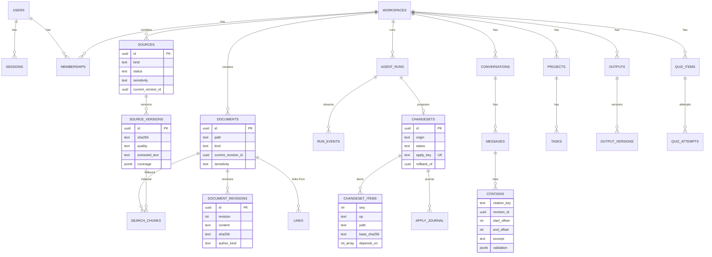

جدول‌های دیگر: `recovery_codes`، `login_attempts`، `user_preferences`، `run_tokens` (توکن کوتاه‌عمر proxy)، `provider_credentials` (کلید رمزشده)، `schedules`، `audit_events`، `backup_manifests`، `native_tickets` (ticket تک‌مصرف ترمینال، با `prefill`)، `native_staging` (snapshot پایهٔ staging)، `app_meta`. migrationها append-only و با قفل advisory اجرا می‌شوند (نسخهٔ فعلی schema: ۳).

---

## ۷. Vault و فایل‌های Markdown

```text
vault/<workspace-slug>/
  CLAUDE.md                 قرارداد upstream (قرنطینه؛ هرگز به runner داده نمی‌شود)
  raw/                      آرشیو خام مالک (فقط‌خواندنی)
  wiki/
    sources/ concepts/ entities/ synthesis/
    index.md  log.md        فقط کد مورداعتماد هنگام apply می‌سازد
  notes/                    یادداشت دستی (افزونهٔ محصول برای نوع note)
  projects/  output/  templates/
```

**VaultService** تنها مسیر نوشتن است و این تضمین‌ها را دارد:

- مسیر نسبی معتبر: منع `..`، مسیر مطلق، backslash، نام رزرو، کاراکتر کنترلی؛ `realpath` روی نزدیک‌ترین والد موجود و رد هر symlink.
- نوشتن اتمی: فایل موقت در همان پوشه ← `fsync` ← `rename` ← `fsync` پوشه.
- optimistic concurrency: ذخیرهٔ دستی با `baseRevisionId`؛ ناسازگاری با revision DB یا hash دیسک ⇒ `409 conflict`.
- reconcile دوره‌ای (هر ۶۰ ثانیه) مبتنی بر hash: فایل جدید ← import، تغییر بیرونی ← revision `external`، تغییرنام فقط وقتی hash یکسان و یک‌به‌یک است، فایل گمشده ← حذف نرم با audit.
- frontmatter با schema هستهٔ YAML 1.2 (بدون tag سفارشی)؛ ویرایش خط‌به‌خط تا کلیدهای ناشناخته و comment حفظ شوند.
- resolve لینک: `[[name#heading|alias]]`، مسیردار، alias؛ دو فایل هم‌نام ⇒ `ambiguous` (هرگز ادغام خاموش).

خوانندگان برنامه همیشه از revision جاری DB می‌خوانند؛ بنابراین در میانهٔ apply حالت نیمه‌اعمال‌شده دیده نمی‌شود.

---

## ۸. ورود منبع و استخراج

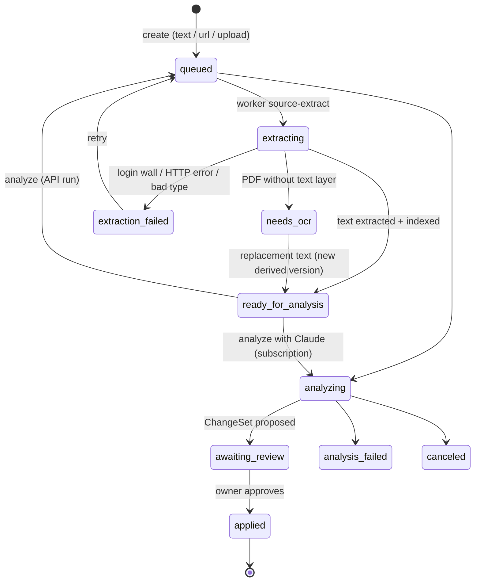

| نوع ورودی | استخراج‌کننده | جزئیات |
|---|---|---|
| متن / Markdown / transcript | UTF-8 (fatal decoder) | بایت‌به‌بایت حفظ؛ hash ثبت |
| URL عمومی | `safeFetch` + Readability (linkedom، بدون اجرای JS) | SSRF guard، تشخیص login wall/paywall، ذخیرهٔ پاسخ خام با checksum |
| PDF | pdfjs-dist | جداکنندهٔ صفحه `\f` ⇒ ارجاع شماره صفحه؛ کم‌متن ⇒ `needs_ocr` |
| JSON گفتگو | parser قطعی | قالب‌های `chat_messages`، `mapping` (شاخهٔ فعال + گزارش شاخه‌ها)، `messages`؛ ناشناخته ⇒ خطا |

**فایل خام هرگز تغییر نمی‌کند:** ذخیره‌سازی content-addressed (`sources/<ws>/<sha[0:2]>/<sha>.<ext>`، mode 0440). اصلاح متن = نسخهٔ مشتق جدید. تکراری قطعی با hash یا URL کانونی تشخیص داده می‌شود و فقط علامت می‌خورد.

---

## ۹. موتور عامل و اجرای مدل

### ۹٫۱ registry مهارت‌ها

همهٔ دکمه‌ها، فرمان‌های palette و زمان‌بندی‌ها به یک registry نسخه‌دار می‌رسند (`packages/core/src/agents/registry.ts`):

| mode | مهارت‌ها | ابزارها |
|---|---|---|
| **propose** | ingest | `read_source`، `list_index`، `search_wiki`، `read_note`، `get_backlinks`، `propose_change` |
| **read** | query، report، write، quiz | `list_index`، `search_wiki`، `read_note`، `get_backlinks` |
| **deterministic** | lint، graph، metrics، chat-import، transcript، project، privacy | کد قطعی، بدون مدل |
| پیاده‌نشده | rename، merge، review، backfill، publish، changed-my-mind | با برچسب صادقانه در UI |

### ۹٫۲ مسیر اجرای API (اتوماسیون)

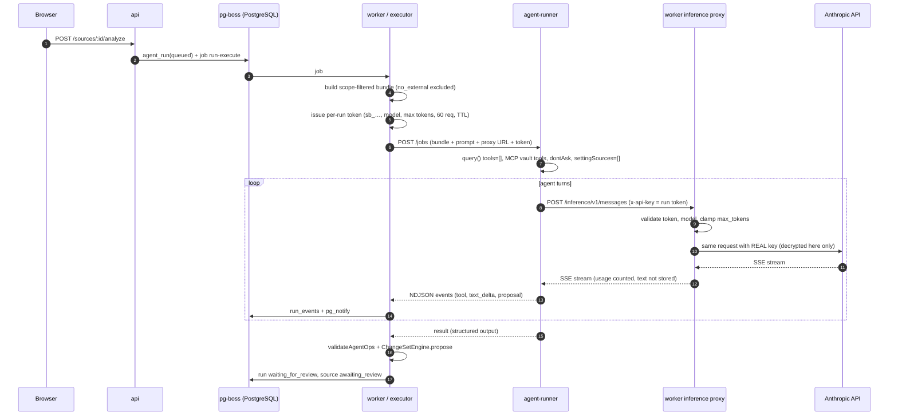

**تنظیمات Agent SDK در runner:** `tools: []` (هیچ ابزار داخلی Bash/Read/Write/Web)، فقط MCP درون‌فرایندی `vault`، `allowedTools` دقیق، `disallowedTools` پشتیبان، `permissionMode: 'dontAsk'`، `settingSources: []` (هیچ CLAUDE.md/hook/تنظیمات فایل‌سیستم)، `strictMcpConfig`، `persistSession: false`، `outputFormat: json_schema`، `maxTurns`، `maxBudgetUsd`، HOME خالی و یکتا برای هر job، و `env` کاملاً جایگزین‌شده (کلید واقعی هرگز وارد runner نمی‌شود).

### ۹٫۳ وضعیت‌های run

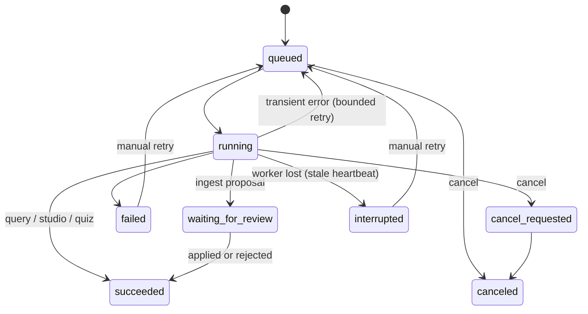

اجرای قطع‌شده هرگز خودکار تکرار نمی‌شود (جلوگیری از هزینهٔ تکراری). خطای credential یا ورودی تکرار نمی‌شود؛ خطای موقت حداکثر ۳ تلاش با backoff.

### ۹٫۴ ارائه‌دهندهٔ mock

فقط در پروفایل `test`/`development` (`MODEL_PROVIDER_MODE=mock`) پذیرفته می‌شود و در `production` باعث خطای startup است. proxy به‌جای Anthropic یک Messages API قطعی را صدا می‌زند تا SDK واقعی، runner، ابزارها و ChangeSet در CI بدون کلید آزموده شوند. هر خروجی آن «آزمایشی» برچسب می‌خورد.

---

## ۱۰. ChangeSet: پیشنهاد، اعمال، بازگردانی

ChangeSet مرز اصلی اعتماد است: خروجی عامل، import vault، یادداشت از پاسخ و تغییرات Claude Code همه به ChangeSet تبدیل می‌شوند.

### ۱۰٫۱ اعتبارسنجی سمت سرور

- مسیر عامل فقط `wiki/{sources,concepts,entities,synthesis}/*.md`؛ `raw/`، `index.md`، `log.md` و پیکربندی هرگز.
- frontmatter بدون خطا و نوع منطبق با پوشه؛ سقف ۴۰ عملیات و ۲۰۰KB برای هر فایل.
- وابستگی: موردی که به صفحهٔ ساخته‌شده در همان بسته لینک می‌دهد به آن وابسته است؛ پذیرش جزئیِ شکنندهٔ وابستگی رد می‌شود.

### ۱۰٫۲ پروتکل apply با journal

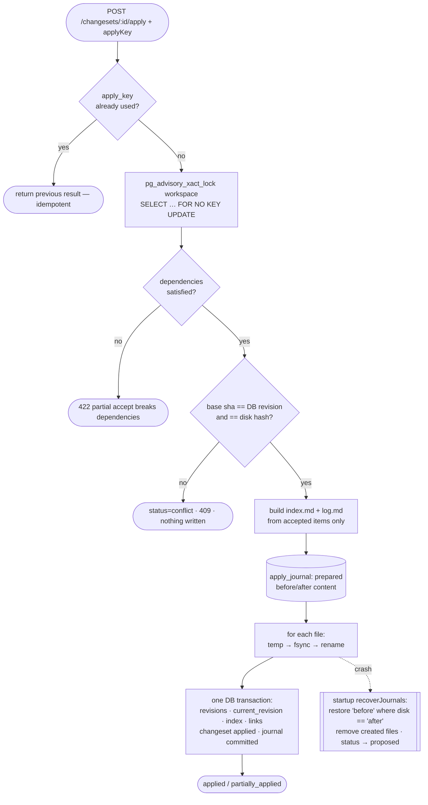

### ۱۰٫۳ بازگردانی بدون پاک‌کردن ویرایش‌های بعدی

rollback یک ChangeSet جدید است: برای هر فایل، وصلهٔ معکوس (after→before) روی **متن فعلی** اعمال می‌شود. اگر کاربر بعداً بخش دیگری را ویرایش کرده باشد، آن ویرایش حفظ می‌شود؛ اگر روی همان خطوط باشد، تعارض گزارش می‌شود. صفحه‌ای که همان بسته ساخته بود فقط وقتی حذف می‌شود که دست‌نخورده باشد. `git reset` هرگز استفاده نمی‌شود.

---

## ۱۱. پرسش مستند، ارجاع و SSE

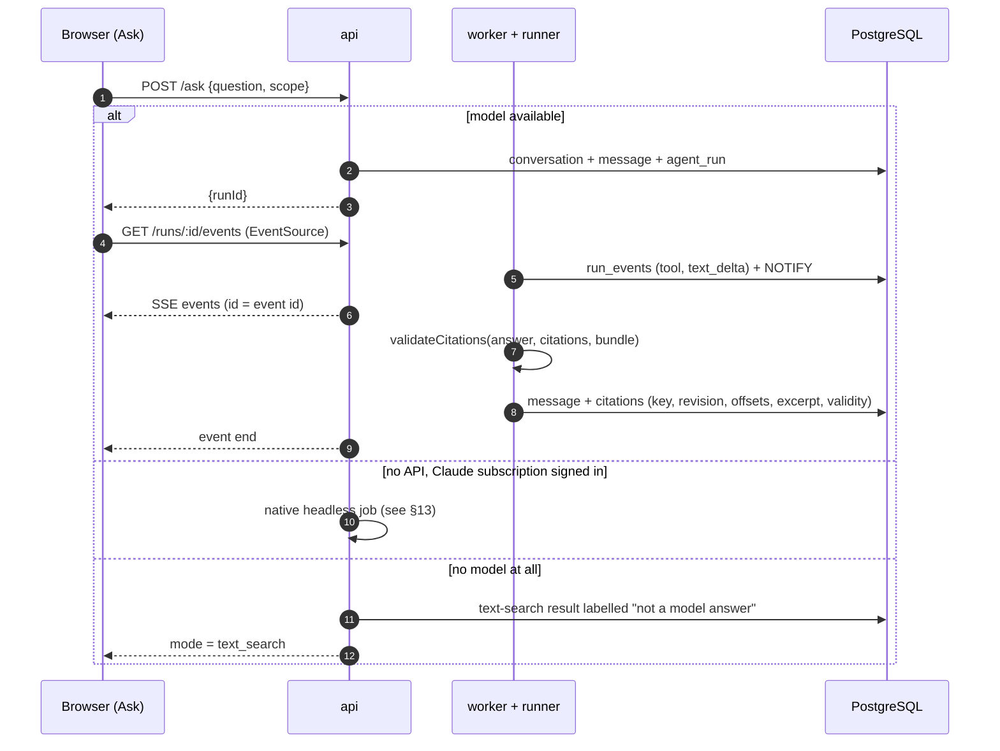

- **کلید ارجاع:** هر بخش bundle یک کلید (`C12` برای صفحه، `S3` برای منبع) دارد. مدل فقط باید کلیدهای همان run را به‌کار ببرد و نقل‌قول دقیق بدهد.
- **اعتبارسنجی:** کلید ساختگی، نقل‌قول نامنطبق با بخش، و نشانهٔ `[Cn]` بدون مدخل citation جدا گزارش می‌شوند. اعتبار ساختاری به معنای درستی معنایی نیست و این در UI گفته می‌شود.
- **نسخه:** citation به `revision_id` و بازهٔ offset متن اصلی متصل است؛ اگر صفحه بعداً تغییر کند، «تغییر کرده» نمایش داده می‌شود.
- **SSE:** فقط با نشست و عضویت همان workspace؛ resume با `Last-Event-ID` فقط رویدادهای بعدی همان run را برمی‌گرداند؛ یک اتصال `LISTEN` در هر فرایند api رویدادها را پخش می‌کند.

---

## ۱۲. جست‌وجوی فارسی

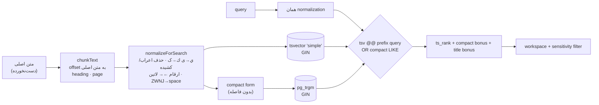

«می‌شود»، «می شود» و «میشود» یکسان پیدا می‌شوند؛ «كتاب علي» با «کتاب علی» برابر است؛ ولی متن ذخیره‌شده و offsetهای ارجاع هرگز تغییر نمی‌کنند. embedding در نسخهٔ ۱ وجود ندارد و ادعا هم نمی‌شود.

---

## ۱۳. دو مسیر اتصال Claude

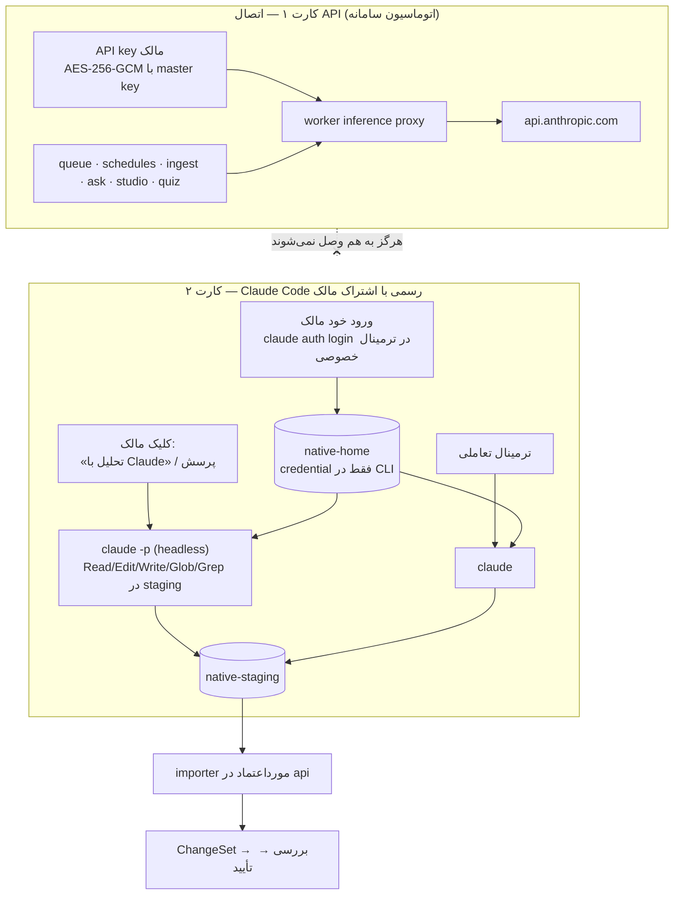

| | کارت API | کارت native (اشتراک) |
|---|---|---|
| credential | API key مالک، رمزشده در DB | login رسمی CLI در volume جدا؛ برنامه آن را نمی‌خواند |
| آغازکننده | صف، دکمه، زمان‌بندی | فقط کلیک مالک یا ترمینال تعاملی |
| اجرا | Agent SDK در runner ایزوله | باینری دست‌نخوردهٔ Claude Code 2.1.291 در کانتینر native |
| ابزار | MCP محدود به bundle | Read/Edit/Write/Glob/Grep فقط در staging؛ Bash و وب مسدود |
| خروجی | ChangeSet، پاسخ با citation اعتبارسنجی‌شده | ChangeSet از importer؛ پاسخ با پیوند `[[صفحه]]` |
| هم‌زمانی | قابل تنظیم (پیش‌فرض ۲) | یک اجرا در هر لحظه |

### ۱۳٫۱ تحلیل پس‌زمینه با اشتراک

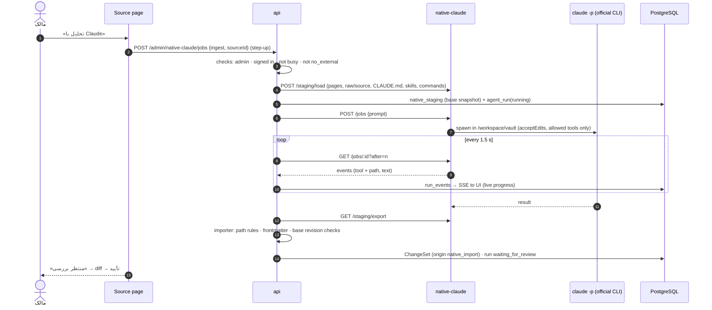

شرایط این مسیر در `docs/CLAUDE-AUTH-DECISION.md` ثبت شده است: فقط استفادهٔ خود مالک، با کلیک خودش، بدون صف و زمان‌بندی، با باینری رسمی و login خود او.

### ۱۳٫۲ ترمینال تعاملی

WebSocket `/api/v1/admin/native-claude/terminal` فقط وقتی باز می‌شود که: `Origin == APP_ORIGIN`، کوکی نشست معتبر است، ticket تک‌مصرف ۶۰ ثانیه‌ای برای **همین نشست و همین کاربر** صادر شده، نقش admin است و step-up اخیر وجود دارد. فرمان‌ها ثابت‌اند (`claude auth login`، `claude`)؛ متن ترمینال ذخیره یا لاگ نمی‌شود؛ idle timeout ۱۵ دقیقه؛ لغو نشست برنامه ترمینال را می‌بندد. «بستن ترمینال» با «خروج از حساب Claude» (`claude auth logout`) فرق دارد.

---

## ۱۴. امنیت و مرزهای اعتماد

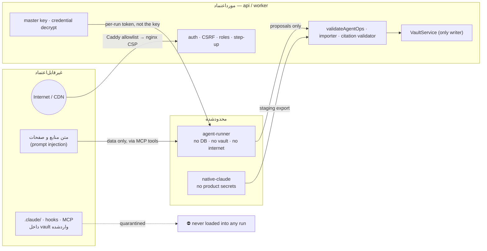

| تهدید | کنترل |
|---|---|
| SSRF در URL fetcher | فقط http/https، پورت‌های مجاز، resolve و بررسی IP (loopback/private/link-local/metadata/IPv6 داخلی) و **اتصال به همان IP بررسی‌شده** (ضد DNS rebinding)، بررسی دوبارهٔ هر redirect، سقف اندازه پس از decompress |
| آرشیو مخرب | پیش از استخراج: zip-slip، symlink، تعداد، اندازهٔ کل و نسبت فشرده‌سازی (zip-bomb)؛ CRC و اندازهٔ واقعی |
| XSS | DOMPurify با allowlist (بدون SVG/iframe/script/style/img)؛ CSP بدون inline script؛ export HTML با escape کامل |
| فایل نامطمئن | دانلود با `Content-Disposition: attachment`، `nosniff` و `CSP: sandbox` |
| prompt injection | قواعد محصول در system prompt + مرز واقعی در ابزار/سرور: runner هیچ secret یا شبکه‌ای ندارد و نوشتن فقط پیشنهاد است |
| IDOR | همهٔ کوئری‌ها با workspace عضویت؛ شناسهٔ حدس‌زده‌شده ⇒ 404 |
| نشت secret | redaction در logger، پاسخ masked، lint برای الگوی کلید، secretها خارج از image و Git |
| دسترسی مستقیم به origin | Caddy فقط IPهای ArvanCloud را می‌پذیرد؛ بقیه 403 |

مدل تهدید کامل: `docs/THREAT-MODEL.md`.

---

## ۱۵. پشتیبان، بازیابی و انتقال داده

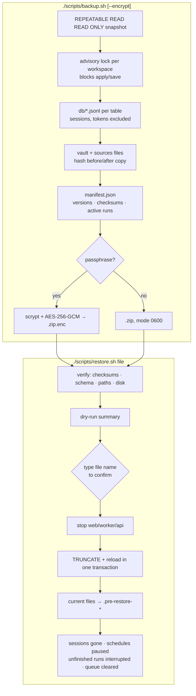

- master key **داخل پشتیبان نیست**؛ باید جدا و بیرون از سرور نگه داشته شود.
- credential ورود native در پشتیبان عادی نیست؛ پس از بازیابی دوباره وارد می‌شوید.
- **export قابل حمل** (`/transfer`): ZIP از Markdown صفحات، خروجی‌ها و فایل‌های خام، بدون حساب/نشست/کلید.
- **import نسخهٔ HTML**: preview، جداسازی دادهٔ نمونه (فقط در فضای demo)، یادداشت‌ها به‌صورت ChangeSet.
- **import vault ZIP**: اسکن فقط‌خواندنی، قرنطینهٔ `.claude/`، صفحات به‌صورت ChangeSet.

---

## ۱۶. صف، زمان‌بندی و مشاهده‌پذیری

| صف (pg-boss) | سیاست | کار |
|---|---|---|
| `source-extract` | ۳ retry با backoff | استخراج و ایندکس منبع |
| `run-execute` | ۳ retry فقط برای خطای موقت | اجرای run مدل |
| `schedule-tick` | singleton، هر دقیقه | ارزیابی زمان‌بندی‌ها و یافتن runهای معطل |

**زمان‌بندی:** هر slot با compare-and-set روی `last_slot` فقط یک بار claim می‌شود؛ slotهای ازدست‌رفته طبق `skip` یا `run_once` (هرگز یک بار برای هر slot)؛ اجرای قبلی فعال ⇒ رد بدون هم‌پوشانی؛ ingest زمان‌بندی‌شده فقط **پیشنهاد** می‌سازد.

**سلامت:** `/health/live`، `/health/ready` (DB + schema؛ مستقل از مدل)، و `/api/v1/system/status` با سه مدل جدا: readiness سرویس، وضعیت providerها (API و native)، و capabilityهای قابل استفاده برای کاربر.

**لاگ:** JSON ساختاریافته با `requestId`/`runId`/`workspaceId`، بدون متن منبع یا گفتگو، با redaction؛ nginx و Caddy بدون query string؛ rotation در Docker. **audit** برای ورود، کلید، ترمینال، apply، backup و import.

---

## ۱۷. فرانت‌اند

React 19 + react-router 8 + TanStack Query 5، با CSS مرجع (`styles/reference.css`) و افزوده‌های محدود (`styles/app.css`)؛ فونت Vazirmatn به‌صورت self-hosted.

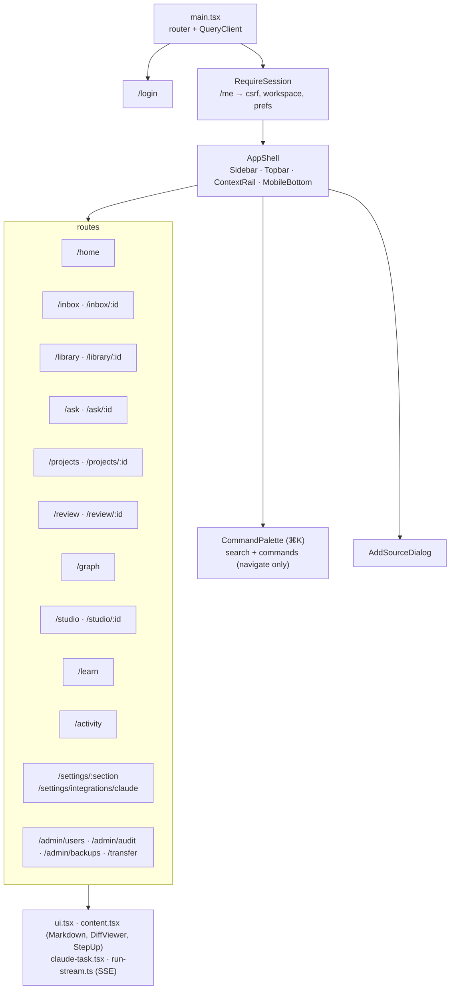

- مسیرهای واقعی با deep-link و refresh؛ هیچ داده‌ای در localStorage جز ترجیح ظاهر.
- RTL کامل؛ کد، مسیر و URL به‌صورت LTR؛ تاریخ شمسی و ارقام فارسی با timezone کاربر.
- dialog بومی (focus trap، Escape)، label فرم‌ها، focus-visible، reduced motion.
- ویرایشگر Markdown: پیش‌نمایش زنده، autosave با debounce، dirty state، تعارض بدون بازنویسی خاموش، هشدار خروج.
- گراف: Cytoscape با سه نوع رابطه (لینک واقعی، رابطهٔ پذیرفته، برچسب مشترک خط‌چین) و نمای فهرستی جایگزین.

---

## ۱۸. استقرار، دامنه و عملیات

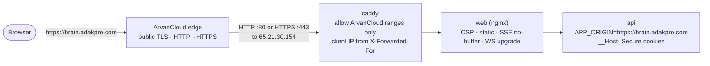

| فایل | کاربرد |
|---|---|
| `compose.yaml` | پایه؛ در حالت local فقط `127.0.0.1:8080` |
| `compose.production.yaml` | افزودن Caddy روی 80/443، حذف پورت web، کوکی Secure؛ `CADDYFILE` قابل انتخاب |
| `infra/docker/Caddyfile` | دامنهٔ مستقیم با Let's Encrypt |
| `infra/docker/Caddyfile.behind-cdn` | پشت ArvanCloud: allowlist، `trusted_proxies`، گواهی internal برای :443 |
| `compose.test.yaml` | پروفایل test با mock روی 8081 و volumeهای جدا |

| اسکریپت | کار |
|---|---|
| `bootstrap.sh` | بررسی Docker/Compose، ساخت secret **فقط اگر نباشد**، build و اجرا |
| `create-admin.sh` | ساخت مالک تعاملی (گذرواژه بدون echo)؛ `--reset-password` |
| `doctor.sh` | بررسی فقط‌خواندنی secretها، سلامت، پورت‌ها و ایزولاسیون runner |
| `backup.sh` / `restore.sh` | بخش ۱۵ |
| `update.sh` | backup → build → migrate → اجرا → doctor (بدون حذف volume) |
| `test.sh` | lint، typecheck، unit، integration، build، compose config، audit |

تنظیم لازم در ArvanCloud: رکورد A برای `brain` با مقدار IP سرور و پروکسی فعال؛ پروتکل origin ترجیحاً HTTP؛ عدم cache برای `/api/*` و `/health/*`؛ فعال‌بودن WebSocket.

---

## ۱۹. فناوری‌ها و نسخه‌ها

| لایه | فناوری | نسخه |
|---|---|---|
| Runtime | Node.js (image) | 22.23.3-bookworm-slim |
| مدیریت بسته | pnpm (corepack) | 10.18.3 |
| زبان | TypeScript (typecheck) + esbuild (bundle) | 7.0.2 / 0.28.2 |
| API | Fastify، cookie، multipart، websocket | 5.12.5 |
| DB / صف | PostgreSQL، pg، pg-boss | 17.6 / 8.23.1 / 12.37.0 |
| مدل | `@anthropic-ai/claude-agent-sdk` (CLI bundled) | 0.3.291 (Claude Code 2.1.291) |
| native | `@anthropic-ai/claude-code` رسمی، node-pty، ws | 2.1.291 / 1.1.0 / 8.22.0 |
| امنیت | @node-rs/argon2، otpauth، DOMPurify | 2.2.2 / 9.5.2 / 3.4.16 |
| محتوا | yaml، marked، diff، pdfjs-dist، Readability + linkedom | 2.9.1 / 18.1.0 / 9.0.0 / 6.4.299 / 0.6.0 |
| UI | React، react-router، TanStack Query، Vite، Cytoscape، xterm | 19.3.0 / 8.4.0 / 5.104.1 / 8.3.3 / 3.34.3 / 6.0.0 |
| edge | nginx-unprivileged، Caddy | 1.29.3-alpine / 2.10.2-alpine |

lockfileها: `pnpm-lock.yaml` و `apps/native-claude/package-lock.json`. هیچ `latest` در Dockerfile یا package.json نیست.

---

## ۲۰. راهبرد آزمون

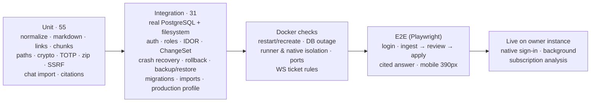

- mock هرگز به‌عنوان موفقیت اتصال واقعی گزارش نمی‌شود؛ آزمون زندهٔ API (C03) تا ثبت کلید مالک `blocked` است.
- نتیجهٔ هر شناسهٔ چک‌لیست پذیرش با وضعیت `passed`/`failed`/`blocked`/`not-run` و مسیر مدرک: `docs/TEST-REPORT.md`.
- benchmark روی ۱۰۰۰ صفحهٔ فارسی/انگلیسی: `evidence/tests/H06-benchmark.json`.

---

## ۲۱. محدودیت‌ها و مسیر آینده

| موضوع | وضعیت |
|---|---|
| مهارت‌های rename، merge، review، backfill، publish، changed-my-mind | پیاده نشده (در UI مشخص) |
| OCR، تبدیل صوت، خروجی PDF/DOCX | در دسترس نیست (501 / پیام صریح) |
| جست‌وجوی معنایی و پیشنهاد ارتباط معنایی | پیاده نشده؛ جست‌وجوی متنی فارسی فعال |
| ترجمهٔ انگلیسی رابط | فقط جهت layout تغییر می‌کند |
| پاسخ ارجاع‌دار بخش‌به‌بخش با اشتراک | فقط پیوند `[[صفحه]]`؛ citation اعتبارسنجی‌شده در مسیر API |
| آزمون HTTPS انتهابه‌انتها، backup/restore در Docker | ثبت‌شده به‌عنوان not-run در گزارش آزمون |
| arm64 | build/test نشده |

اسناد مرتبط: `docs/UPSTREAM-AUDIT.md`، `docs/FEATURE-MAP.md`، `docs/ADR/0001–0005`، `docs/CLAUDE-AUTH-DECISION.md`، `docs/THREAT-MODEL.md`، `docs/IMPLEMENTATION-STATUS.md`، `docs/TEST-REPORT.md`، `docs/CONTINUATION.md`.
